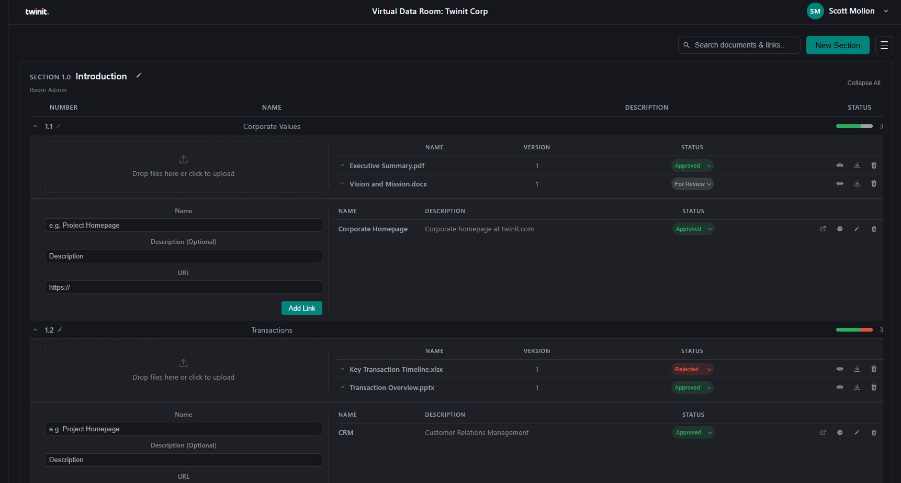

# Virtual Data Room

**Secure. Structured. Collaborative.**

The Virtual Data Room (VDR) is a purpose-built document management platform for teams that need controlled, auditable access to sensitive materials. Built on the [Twinit](https://twinit.dev) platform, the VDR provides a structured environment where every document, link, and user action is tracked, versioned, and governed by role-based permissions — giving administrators full confidence in what is shared and with whom.

## Key Features

- **Organised by Sections and Subsections** — Content is structured in a two-level hierarchy that mirrors real-world deal, project, or compliance folder structures. Each section has its own independent access control.
- **Role-Based Access Control** — Four distinct roles (Room Admin, Section Admin, Section Contributor, Section Viewer) give administrators precise control over who can view, upload, edit, or manage content within each section.
- **Document Versioning & Status Tracking** — Every uploaded document is automatically versioned. Status labels (For Review, Approved, Rejected) with a full audit log make it easy to track document lifecycle from submission through approval.
- **In-Browser Document Viewing & Download** — Documents can be viewed directly in the browser without leaving the Room, and downloaded at any time. Version history is accessible from the same document row.
- **External Links** — Alongside file uploads, teams can add and track external URL references with the same status and history controls as documents.
- **Search** — Instantly find documents and links across the entire Room with a live, debounced search that highlights results in context.
- **Safe Deletion with Trash Bin** — Items moved to trash are held in a recoverable state. Only Room Admins can permanently delete, with a confirmation step and clear cascade warnings.
- **Audit Trail** — Status changes on documents and links are recorded with timestamps and optional notes, providing a complete history of every review decision.

---

# Documentation

This documentation is split into two top-level guides.

---

## User Guide

For end users who want to learn how to use the application.

| Topic | Description |
|---|---|
| [Getting Started](./docs/user/getting-started.md) | Signing in, selecting a Room, and navigating the UI |
| [Access & Roles](./docs/user/access-and-roles.md) | Understanding Room Admin, Section Admin, Contributor, and Viewer roles |
| [Managing Sections](./docs/user/managing-sections.md) | Create, edit, and remove top-level sections |
| [Managing Subsections](./docs/user/managing-subsections.md) | Create, edit, and navigate subsections |
| [Documents](./docs/user/documents.md) | Upload, view, version, and track document status |
| [Links](./docs/user/links.md) | Add, edit, and track external URL references |
| [Search](./docs/user/search.md) | Find documents and links across the entire Room |
| [Trash Bin](./docs/user/trash-bin.md) | Restore or permanently delete trashed items (Room Admin only) |
| [Manage Users](./docs/user/manage-users.md) | Invite users and view section group membership (Room Admin only) |

---

## Developer Guide

For developers who want to understand how the application is built, set it up locally, or extend it.

| Topic | Description |
|---|---|
| [Architecture Overview](./docs/developer/architecture.md) | Tech stack, project structure, and the layered architecture |
| [Setup & Configuration](./docs/developer/setup-and-configuration.md) | Local dev setup, environment variables, Twinit project config, and building |
| [Authentication](./docs/developer/authentication.md) | OAuth 2.0 PKCE flow, token storage, and session expiry handling |
| [Data Model](./docs/developer/data-model.md) | Sections, subsections, documents, and links: fields and relationships |
| [Backend API](./docs/developer/backend-api.md) | OMAPI endpoint reference and backend scripts |
| [Permissions & Access Control](./docs/developer/permissions.md) | Section user groups, permission sets, and the creation flow |
| [Services & State Management](./docs/developer/services-and-state.md) | React Query hooks, cache keys, and invalidation strategy |
| [Component Reference](./docs/developer/components.md) | Every component's role and how they connect |
